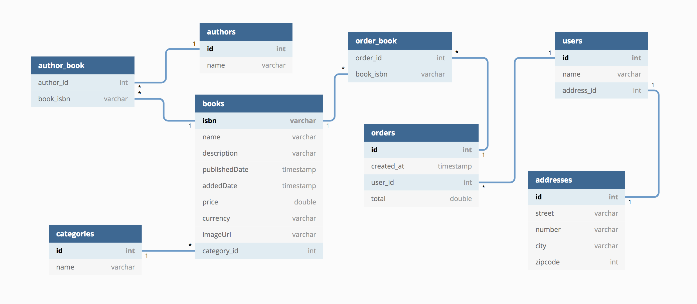

# Spring data jpa kullanarak veritabanı işlemleri



Yukardaki veritabanı tasarımına uygun şekilde Entity tasarımını yapınız ve birkaç kitap, yazar, kullanıcı ve sipariş yaratınız.
JPA anotasyonlarını cascade ve fecth stratejilerini uygun şekilde kullanınız. Veritabanı olarak H2 kullanabilirsiniz.
Ayrıca kitap ismine göre ve yazar ismine göre arama, kullanıcının sipariş bilgilerini gösterme gibi temel sorgular eklenmelidir.

Odev deadline : 24.01.2021 saat 00:00

============================================***Aciklamalar*** ==================================================

- Uygulamada Spring Data JPA, Hibernate, H2 Database kullanılmıştır.
- İçerisinde OneToOne, OneToMany ve ManyToMany ilişkileri kullanılmıştır.
- Repository içerisine örnek ek fonksiyonlar eklenmiştir.


##### Uygulama İçerisinden Örnekler

- Sipariş tutarı 23.45 olan kullanıcıların listesi

``` java
[ User{id=1, name='Osman DENIZ', address=
        Address{id=2, street='Gazi sokak', number='7', city='Istanbul', zipcode=0}, orders=[
		Orders{id=3, created_at=2021-01-23, total=23.45, orderBooks=[
		Book{isbn='abf25276-23ad-48c1-b7b2-75733ab996a3', name='Nutuk', category=
		Category{id=4, name='Turk Tarihi'}, authors=[
		Authors{id=5, name='Mustafa Kemal Ataturk'}]}]}]}, 

User{id=6, name='Huseyin Karabakla', address=
		Address{id=7, street='Gazi sokak', number='7', city='Istanbul', zipcode=0}, orders=[
		Orders{id=8, created_at=2021-01-23, total=23.45, orderBooks=[
		Book{isbn='5271ba5d-4a21-45f8-9cf9-4ed230e49cc3', name='Istiklal Marsi', category=
		Category{id=9, name='Turk Marslari'}, authors=[
		Authors{id=10, name='Mehmet Akif Ersoy'}]}]}]}]```
```


- İçerisinde "se" geçen kullanıcılar 

```java
User{id=6, name='Huseyin Karabakla', address=
		Address{id=7, street='Gazi sokak', number='7', city='Istanbul', zipcode=0}, orders=[
		Orders{id=8, created_at=2021-01-23, total=23.45, orderBooks=[
		Book{isbn='4a8cda1f-0226-457b-9464-ad439431cdc4', name='Istiklal Marsi', category=
		Category{id=9, name='Turk Marslari'}, authors=[
		Authors{id=10, name='Mehmet Akif Ersoy'}]}]}]}]
```


- Yazar adına göre arama

```java
	Book{isbn='c30fc9aa-a925-4403-9483-d3c10954e804', name='Istiklal Marsi', category=
		Category{id=1, name='Turk Marslari'}, authors=[
		Authors{id=2, name='Mehmet Akif Ersoy'}]}
```


- Kategori adına göre arama

```java
Book{isbn='c30fc9aa-a925-4403-9483-d3c10954e804', name='Istiklal Marsi', category=
  		Category{id=1, name='Turk Marslari'}, authors=[
  		Authors{id=2, name='Mehmet Akif Ersoy'}]}
```

  